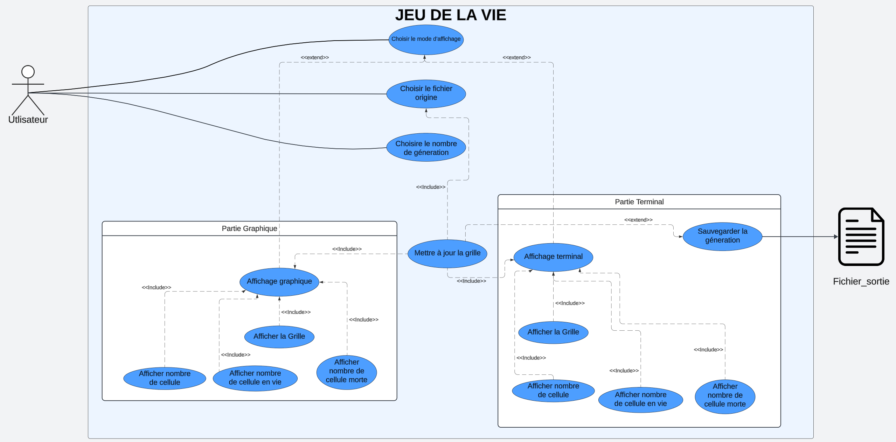
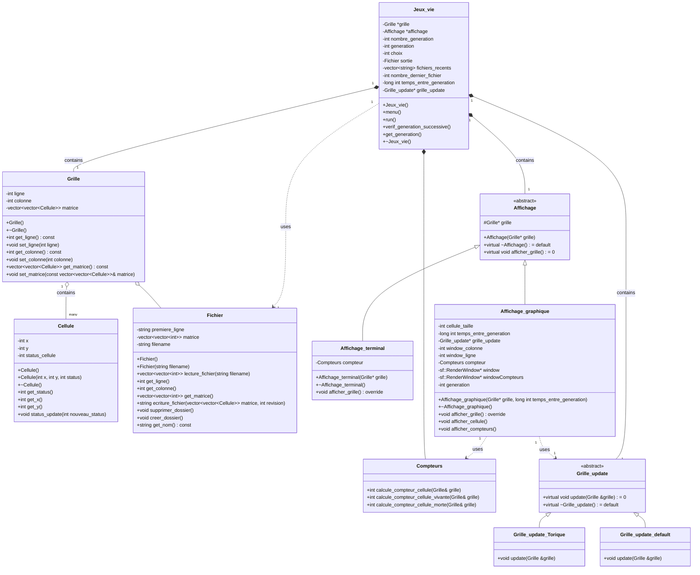
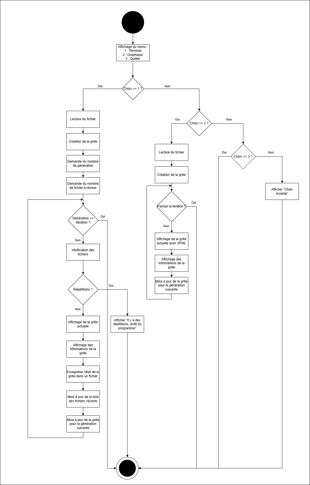

# 🎲 Projet Jeu de la Vie CPIA2

## 👥 Fait par :
- Musmus05 : Madani Mustapha
- Cherubalex : Maumy Alexandre

## 📄 Pour plus d'information (Documentation)
Pour plus d'informations, consultez la [documentation technique et utilisateur](./Documentations_jeu_de_la_vie_Groupe6.pdf)


## 📚 Description
Ce projet implémente le célèbre "Jeu de la Vie" de John Conway en C++. Le jeu de la vie est un automate cellulaire où des cellules vivent, meurent ou se multiplient selon des règles simples.

## 🚀 Fonctionnalités
- Initialisation de la grille à partir d’un fichier spécifiant l’état initial.
- Evolution de la grille selon les règles du jeu.
- Affichage de la grille à chaque étape :
  - Mode terminal (console).
  - Mode graphique (avec SFML).

## 🛠️ Langages et Technologies
- C++ (98.1%)
- Makefile (1.3%)
- Python (0,6%)

## 📄 Format des Fichiers d’Entrée

Le fichier d’état initial doit avoir le format suivant :

- **Première ligne** : Dimensions de la grille (`hauteur largeur`).
- **Lignes suivantes** : État initial des cellules (0 pour mort, 1 pour vivant).

### Exemple :
```plaintext
5 10
0 0 1 0 0 0 0 0 0 0
0 0 0 1 0 0 0 0 0 0
0 1 1 1 0 0 0 0 0 0
0 0 0 0 0 0 0 0 0 0
0 0 0 0 0 0 0 0 0 0
```

## 📦 Installation
Pour compiler et exécuter le projet, utilisez les commandes suivantes :

```sh
make
./main
```

## 📝 Règles du Jeu
1. Toute cellule vivante avec moins de deux voisins vivants meurt, comme par sous-population.
2. Toute cellule vivante avec deux ou trois voisins vivants survit à la génération suivante.
3. Toute cellule vivante avec plus de trois voisins vivants meurt, comme par surpopulation.
4. Toute cellule morte avec exactement trois voisins vivants devient vivante, comme par reproduction.

## 📊 Modélisation

### **Diagrammes UML**
Le projet a été conçu à l’aide des diagrammes suivants pour garantir une architecture robuste et modulaire :

- **Diagramme de Cas d’Utilisation** : Identifie les principales interactions entre l’utilisateur et le programme.

- **Diagramme de Classe** : Structure les principales classes et leurs relations.


- **Diagramme d’Activité** : Décrit les étapes clés du processus de simulation.

- **Diagramme de Séquence** : Décrit les interactions dynamiques entre les objets pour chaque itération.
```mermaid
sequenceDiagram
    participant User
    participant Jeux_vie
    participant Grille
    participant Affichage_terminal
    participant Affichage_graphique
    participant Fichier

    User->>Jeux_vie: main()
    activate Jeux_vie
    Jeux_vie->>Jeux_vie: menu()
    Jeux_vie->>User: Afficher le menu
    User->>Jeux_vie: Choisir le type d'affichage
    User->>Grille: Choisire le fichier source
    alt Choix 1: Affichage terminal
        Jeux_vie->>Grille: new Grille()
        Jeux_vie->>Affichage_terminal: new Affichage_terminal(grille)
    else Choix 2: Affichage graphique
        Jeux_vie->>User: Demander le temps entre générations
        User->>Jeux_vie: Entrer le temps
        Jeux_vie->>Grille: new Grille()
        Jeux_vie->>Affichage_graphique: new Affichage_graphique(grille, temps_entre_generation)
    end
    Jeux_vie->>Jeux_vie: run()
    activate Grille
    Jeux_vie->>Fichier: supprimer_dossier()
    loop pour chaque génération
        Jeux_vie->>Affichage: afficher_grille()
        Jeux_vie->>Grille_update: update(grille)
        Grille_update->>Grille: Mettre à jour la matrice
        Jeux_vie->>Fichier: ecriture_fichier(grille->get_matrice(), generation)
        Jeux_vie->>Jeux_vie: verif_generation_successive()
    end
    deactivate Grille
    deactivate Jeux_vie
  ```


